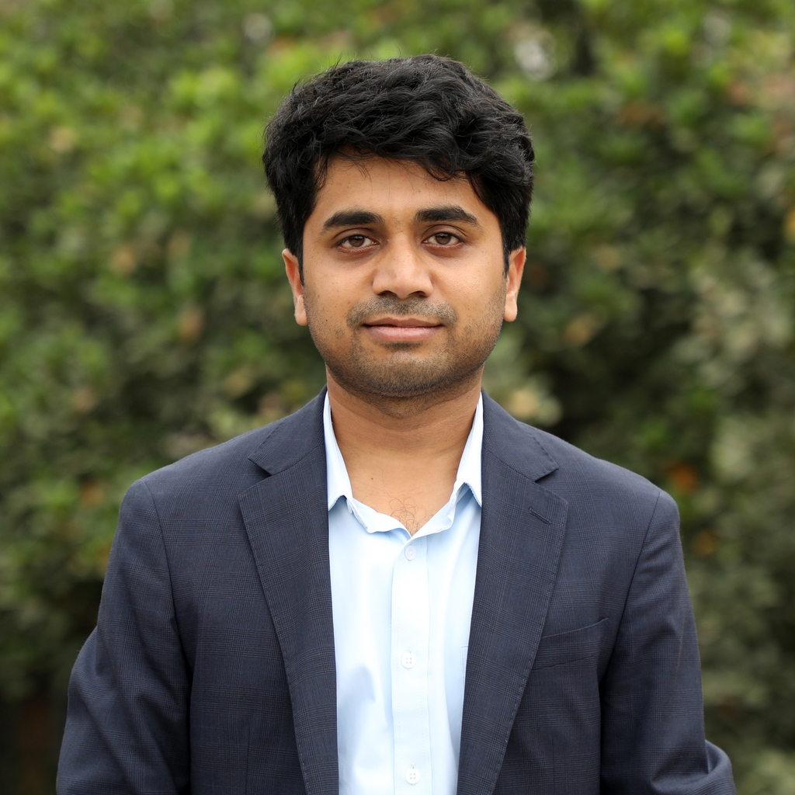

  

    

        <li><a href="https://www.researchgate.net/profile/Soudeep_Deb" target="_blank">ResearchGate</a></li>
        <li><a href="https://scholar.google.com/citations?user=HjWwFs8AAAAJ&hl=en&oi=ao" target="_blank">Scholar</a></li>
        <li><a href="https://www.linkedin.com/in/debsoudeep/" target="_blank">LinkedIn</a></li>
        

  

<table class="wide">
<tr>
<td class="left">
    
</td>
&nbsp; &nbsp; &nbsp; &nbsp; 
<td class="left">
  I am an Assistant Professor of Decision Sciences and   
  Young Faculty Research Chair at <a href="https://www.iimb.ac.in/user/196/soudeep-deb" target="_blank">IIM Bangalore</a>. Before 
  joining IIMB, I worked as Senior Lead Data Scientist at 
  <a href="http://www.nbcuniversal.com/" target="_blank">NBC Universal Media, LLC</a>. In August 2018, I finished my 
  Ph.D. in Statistics from the University of Chicago. Earlier, 
  I studied at Indian Statistical Institute, completing my 
  Bachelor's (in 2011), and Master's (in 2013) in Statistics.
  
  My primary field of work is related to forecasting, 
  time series data, spatio-temporal modeling, inference 
  for random processes. I am also interested in sports 
  analytics, especially problems related to soccer.
  
  My CV is available <a href="https://soudeepd.github.io/Resume/CV_DebSoudeep.pdf" target="_blank">here</a> (last updated on 10th August, 2022).
 
</td>
</tr>
</table>

<tr>
<td class="left">
  <a href="https://outlook.office365.com/owa/calendar/d6111bacc4c5436a998ba66831af56cf@iimb.ac.in/5442b967e74f4e6cb4192e5614e94c05984665050450246395/calendar.html" target="_blank">See my schedule</a> if you want to chat with me, either online or at IIMB.   
 
  <b> Contact: </b>
  C201, Faculty Block C
  Indian Institute of Management, Bangalore
  Bannerghatta Road, Bengaluru, India. 560076
  Email: <a href="mailto:soudeep@iimb.ac.in" target="_blank">soudeep@iimb.ac.in</a>, Phone (O): +91-26993387
</td>
</tr>

