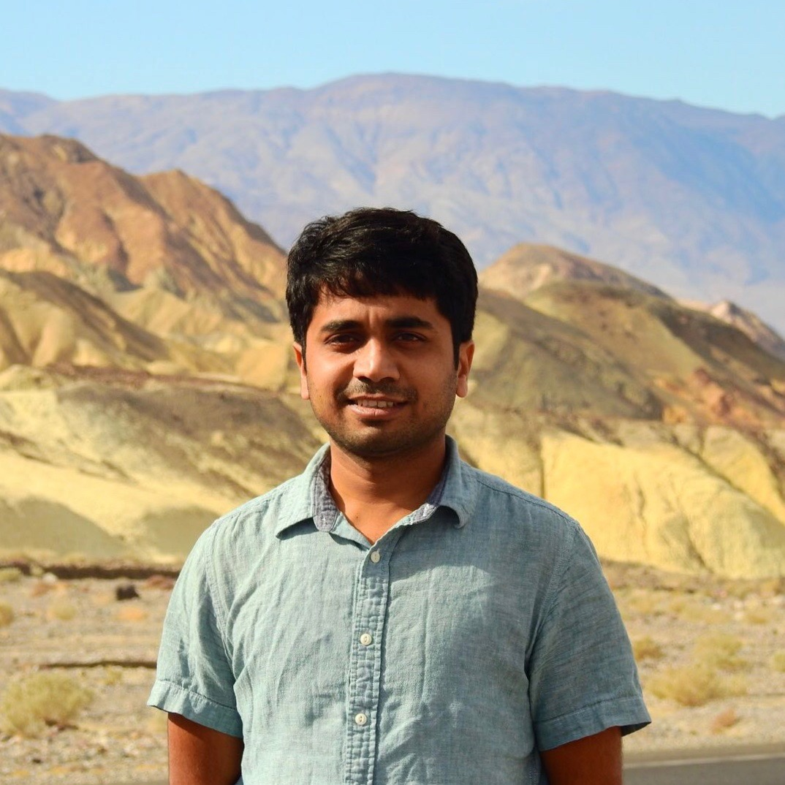

  

    

        <li><a href="<a href="https://www.researchgate.net/profile/Soudeep_Deb" target="_blank">ResearchGate</a></li>
        <li><a href="https://soudeepd.github.io/Resume/CV_DebSoudeep.pdf" target="_blank">CV</a></li>
        <li><a href="https://scholar.google.com/citations?user=HjWwFs8AAAAJ&hl=en&oi=ao" target="_blank">Scholar</a></li>
        <li><a href="https://www.linkedin.com/in/debsoudeep/" target="_blank">LinkedIn</a></li>
        

  

<table class="wide">
<tr>
<td class="left">
    
</td>
&nbsp; &nbsp; &nbsp; &nbsp; 
<td class="left">
  I am an Assistant Professor in Decision Sciences at
  <a href="https://www.iimb.ac.in/user/196/soudeep-deb">Indian Institute of Management, Bangalore</a>. 
  Previously, I worked as Senior Lead Data Scientist at
  <a href="http://www.nbcuniversal.com/">NBC Universal Media, LLC</a>. In August 2018, I completed  
  my Ph.D. in Statistics from the University of Chicago.
  
  My primary field of work is related to forecasting, 
  time series data, spatio-temporal modeling, inference
  for random processes. I am also interested in sports
  analytics, especially problems related to soccer.
 
  Previously, I studied at the Indian Statistical 
  Institute, where I completed my Bachelor's degree 
  (in 2011), and Master's degree (in 2013) in Statistics. 
  
</td>
</tr>
</table>

<tr>
<td class="left">
  <b> Contact: </b>
  C201, Faculty Block C
  Indian Institute of Management, Bangalore
  Bannerghatta Road, Bengaluru, India. 560076
  Email: <a href="mailto:soudeep@iimb.ac.in">soudeep@iimb.ac.in</a>
</td>
</tr>

